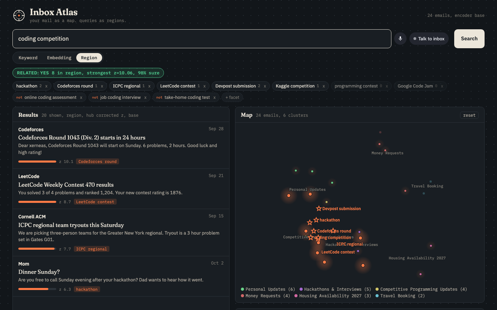
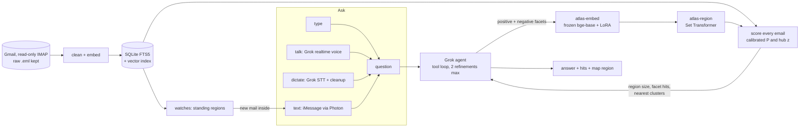
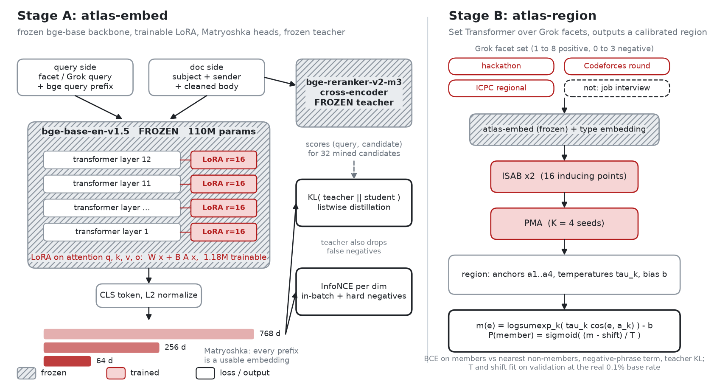
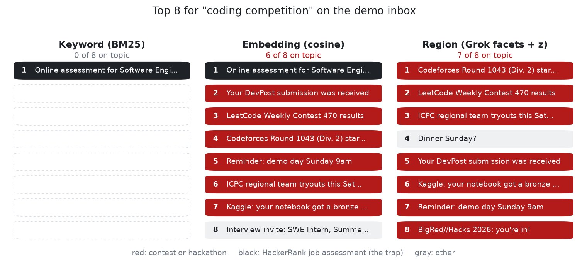
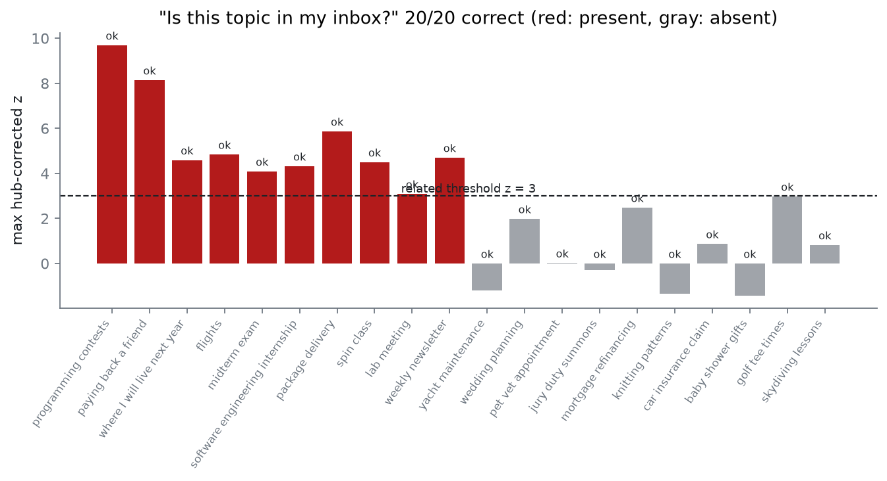
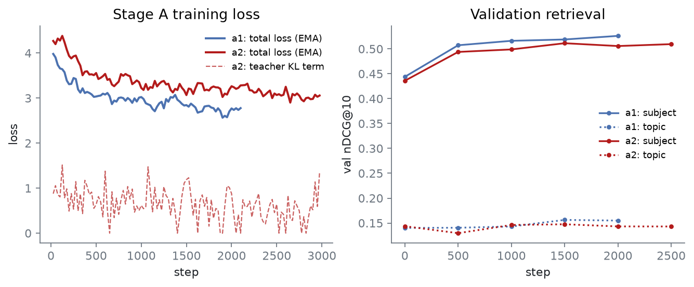
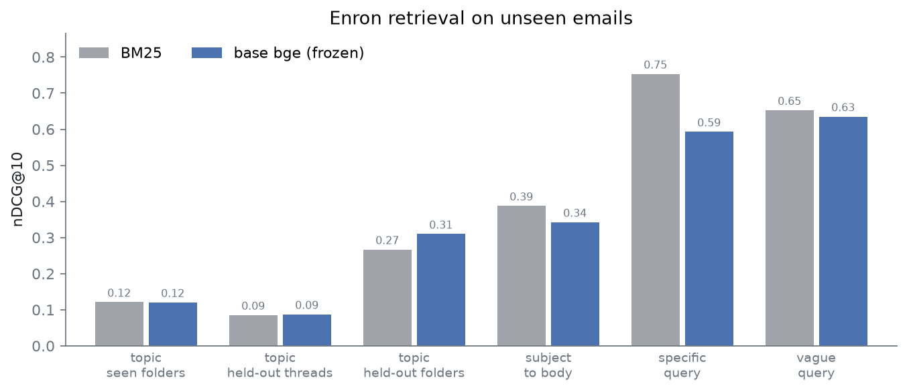

# Inbox Atlas

<div align="center">

[](https://www.python.org/)
[](https://pytorch.org/)
[](https://huggingface.co/BAAI/bge-base-en-v1.5)
[-444?style=flat-square)](https://huggingface.co/BAAI/bge-reranker-v2-m3)
[](https://docs.x.ai/)
[](https://photon.codes/)
[-003366?style=flat-square)](https://www.cs.cmu.edu/~enron/)
[](https://bigredhacks2026.devpost.com/)



</div>

Navigate your inbox by meaning instead of by string. A question becomes a **region** of embedding space, not a keyword: Grok writes a topic list for it, a learned set encoder compresses that list into a region, and a calibrated membership score answers both "which emails?" and "is this topic in my inbox at all?". You can type it, say it, or text it.

## Contents
- [Abstract](#abstract)
- [Installation](#installation)
- [Method](#method)
  - [System](#system)
  - [Query to region](#query-to-region)
  - [atlas-embed: the encoder](#atlas-embed-the-encoder)
  - [atlas-region: the set to region model](#atlas-region-the-set-to-region-model)
  - [Objective](#objective)
  - [Voice and iMessage](#voice-and-imessage)
- [Results](#results)
  - [Search modes](#search-modes)
  - [Is this topic in my inbox?](#is-this-topic-in-my-inbox)
  - [Demo inbox eval](#demo-inbox-eval)
  - [Enron training and eval](#enron-training-and-eval)
- [What is new and what is not](#what-is-new-and-what-is-not)
- [Repository layout](#repository-layout)
- [Reproduction](#reproduction)
- [Limitations](#limitations)
- [Acknowledgements](#acknowledgements)
- [Authors](#authors)

## Abstract

Email search is string matching. Search "coding competition" and Gmail returns the HackerRank job assessment, because it contains the word "coding", and misses the Codeforces round, the ICPC tryout and the DevPost receipt, because none of them say "coding competition". Plain embedding search fixes recall but has no notion of a boundary: it ranks everything, it cannot say "nothing in your inbox is about this", and on our demo inbox it still ranks the job assessment first.

Inbox Atlas treats a query as a region. Grok expands the question into positive facets written in the vocabulary emails actually use (platform names, event names, senders) plus explicit negatives ("job coding interview"). The facets are embedded by **atlas-embed**, a frozen `bge-base-en-v1.5` backbone with LoRA adapters trained on email with Matryoshka dims and listwise distillation from a frozen cross-encoder teacher. **atlas-region**, a Set Transformer, reads the facet set and emits a region: four anchors, per-anchor temperatures and a boundary, calibrated so that `P(member)` is a real probability. Hub-corrected z-scores turn "is this topic related to my inbox?" into a yes/no with a confidence instead of a raw cosine.

On the demo inbox, region search puts 7 of the top 8 results on topic for "coding competition" against 6 of 8 for plain cosine and 0 of 8 for BM25, and the yes/no relatedness check is correct on 20 of 20 present and absent topics. The encoder and region model train on 224,867 deduplicated Enron emails with 426 folder topics, 63 of them held out entirely, plus 19,980 Grok-labeled emails, on one RTX 4070 SUPER. The same tools are exposed to a Grok chat agent, a realtime Grok voice agent, a Whisperflow-style dictation tool, and an iMessage agent you can text ("what do I have today?") that also texts you when new mail lands in a region you are watching.

## Installation

```bash
git clone https://github.com/xerneas3318/inbox-atlas.git && cd inbox-atlas
cp .env.example .env            # XAI_API_KEY, GMAIL_USER, GMAIL_APP_PASSWORD, SPECTRUM_*, OWNER_PHONE
uv sync --extra dev
git config core.hooksPath .githooks
```

```bash
uv run python -m atlas.ingest.load_fixture           # demo inbox, no credentials needed
uv run python -m atlas.ingest.gmail_export --max 0   # or: your whole Gmail, read-only
uv run python -m atlas.index.build --encoder base    # or --encoder models/atlas-embed
uv run python server.py                              # http://localhost:8765
```

Or run the whole backend (API, iMessage sidecar, Postgres, Gmail polling, morning brief) under one
supervisor: `uv run atlas up`, then `atlas status`, `atlas logs -f`, `atlas down`.
`atlas install-service` makes it start at login, and `atlas phone` shows how to open it on your
phone over Tailscale. See [`docs/PHONE.md`](docs/PHONE.md).

Optional pieces: `cd imessage && npm install && npm start` (iMessage agent), `uv run --extra dictate python dictate/dictate.py` (hold Right Option anywhere on macOS to dictate). See [`docs/INGEST.md`](docs/INGEST.md), [`docs/VOICE.md`](docs/VOICE.md), [`docs/IMESSAGE.md`](docs/IMESSAGE.md).

Storage on Tiger Data (Postgres + pgvector, embeddings plus Grok chat history): `docker-compose up -d`, set
`DATABASE_URL`, run `uv run python -m atlas.db.migrate`. Tiger Cloud works by swapping `DATABASE_URL`. See [`docs/TIGER.md`](docs/TIGER.md).

## Method

### System



Gmail is exported read-only (the mailbox is opened with `readonly=True`, bodies are fetched with `BODY.PEEK[]`, and a wrapper raises on any mutating IMAP command). Every raw message is written to disk before parsing. Bodies are cleaned (HTML to text, quoted replies, forwarded headers and signatures stripped) and embedded locally; only top-hit snippets are sent to Grok at query time.

### Query to region

Grok writes structured facets:

```json
{"positive": ["hackathon", "Codeforces round", "ICPC regional", "LeetCode contest", "Devpost submission",
              "Kaggle competition", "programming contest", "Google Code Jam"],
 "negative": ["online coding assessment", "job coding interview", "take-home coding test"]}
```

The tool returns region statistics, not only hits: the region size, hits per facet (including facets that matched nothing) and the nearest map clusters. Grok uses them to steer: it drops facets with zero hits, narrows a region that swallowed 400 emails, and widens an empty one. That loop is capped at two refinements.

```
positive facets P (k x d), negatives N (m x d), emails E (n x d), all L2-normalized

heuristic region:   raw = 0.6 * max_k E.P_k  +  0.4 * E.c  -  1.0 * relu( max_m E.N_m - max_k E.P_k ),  c = mean(P)
learned region:     m(e) = logsumexp_k( tau_k * cos(e, a_k) ) - b,   P(member) = sigmoid( (m - shift) / T )
hub correction:     z_i = ( raw_i - mu_i(k) ) / sigma_i(k),  mu, sigma from random sets of k probe topics
related?            max z >= 3 and raw >= floor
```

Hub correction matters because newsletters and long promotional emails sit close to everything. Each email is scored against random sets of `k` probe topics (276 Grok-written everyday topics), matched to the query's facet count, so an email only counts as in the region if it stands out from what it scores against any random topic set of the same size.

### atlas-embed: the encoder

<p align="center"></p>

Gray hatched blocks are frozen, red blocks are trained. Stage A trains only the LoRA adapters; stage B freezes the whole encoder and trains only the Set Transformer.

```
email text --> [ FROZEN bge-base-en-v1.5, 110M ] + LoRA r=16 on q,k,v,o (1.18M trainable) --> CLS --> L2
                                                                                                  |
                                                    Matryoshka heads: truncate to 768 / 256 / 64, renormalize
                                                                                                  |
                       InfoNCE vs in-batch + mined hard negatives   +   KL( student || FROZEN bge-reranker-v2-m3 )
```

Training pairs, all self-supervised: Enron folder topic to member email, subject to body (rendered without its subject so the subject line is not a shortcut), reply to parent, and Grok-written abstract topics and search queries to their email. Hard negatives are mined with the base encoder; the frozen teacher doubles as a false-negative filter, so a mined candidate the teacher rates at least as relevant as the positive is never used as a negative.

### atlas-region: the set to region model

```
facet phrases (1 to 8 positive, 0 to 3 negative) --> FROZEN atlas-embed --> + type embedding (pos / neg)
        --> ISAB(16 inducing points) --> ISAB --> PMA(K=4 seeds) --> anchors a_1..a_4 (unit), tau_1..tau_4, b
```

Set augmentation (random subset sizes, phrase dropout, small embedding noise) makes it indifferent to how many facets Grok writes. After training, a temperature and an offset are fit on the validation split at the natural base rate (about 0.1 percent of emails belong to a given topic), because a temperature alone left an ECE of 0.42 on the first run.

### Objective

```
L_embed  = sum over d in {768, 256, 64} of
           InfoNCE( q_d, doc+_d ; in-batch + hard negatives, scale 20 )
         + KL( softmax(teacher scores over candidates) || softmax(student scores over candidates) )

L_region = BCE( m(e), member ; members vs nearest non-members )
         + negative-set term: emails nearest the negative phrases must score below the boundary
         + KL( teacher scores for the topic name || region scores )
```

The backbone and the teacher are frozen; only the LoRA adapters (stage A) and then the Set Transformer on cached embeddings (stage B) are trained. An optional stage C adapts the LoRA adapters to your own Gmail with Gmail labels and Grok labels as topics, split by thread.

### Voice and iMessage

- **Dictation (Whisperflow style):** hold to talk, Grok STT (`grok-voice-transcribe-2.0`) transcribes, then a short Grok pass removes fillers and applies self-corrections ("by five, no, six" becomes "by six"). About 1 second end to end. Works in the search box or, through `dictate/dictate.py`, in any macOS app.
- **Talk to your inbox:** a server-side proxy to the Grok realtime voice API with the same tools. Grok calls `search_region`, the map highlights the hits while it speaks.
- **iMessage:** a Photon Spectrum sidecar. Text it a question and it answers from your mail and calendar ("what do I have today?"). It also texts you first: a morning brief, and an alert whenever new mail falls inside a region you asked it to watch ("watch internships").

## Results

### Search modes

<p align="center"></p>

Top 8 for "coding competition" on the 24-email demo inbox with the frozen base encoder. BM25 finds one email, the job assessment, because it is the only one containing "coding". Plain cosine ranks the job assessment first. The region, with Grok's negatives, pushes it out of the top 8. The one gray email in the region list is a message from family asking about "your hackathon", which is arguably relevant.

### Is this topic in my inbox?

<p align="center"></p>

Ten topics present in the demo inbox and ten absent ones (never shown to the expansion prompt). 20 of 20 correct on this run. Two cases sit near the threshold: "golf tee times" (absent) at z 3.0 and "lab meeting" (present) at z 3.1; an earlier run got 19 of 20 with "lab meeting" at z 2.99. The threshold is a single fixed number across every topic.

### Demo inbox eval

12 handwritten queries whose words do not appear in the target emails, a pool of the top 20 from every method, and Grok as the relevance judge (`eval/run_eval.py`, full per-query table in [`eval/results.md`](eval/results.md)). Base encoder.

| method | Recall@10 | nDCG@10 |
|---|---:|---:|
| keyword (BM25) | 0.175 | 0.217 |
| embedding (cosine) | 0.811 | 0.828 |
| region, query only | 0.839 | 0.846 |
| region, no negatives | 0.887 | 0.885 |
| region, no hub z | 0.874 | 0.880 |
| region (full) | 0.867 | 0.876 |
| hybrid (region + BM25, RRF) | 0.886 | 0.820 |

Every region variant beats single-vector cosine. On 24 emails the ablations are within noise of each other (the full region is not the best row), so this table supports "regions beat a single query vector", not the value of each component.

### Enron training and eval

Data after cleaning: 224,867 deduplicated emails, 426 folder topics (63 held out entirely), splits train 175,353 / val 10,817 / held-out threads 20,779 / held-out topics 17,918. 19,980 emails Grok-labeled. Teacher scores for 491k pairs. All on one RTX 4070 SUPER (stage A at 0.84 s per step, 4.2 GB with gradient checkpointing).

<p align="center"></p>

Run `a1` is the first pass without the teacher; `a2` adds Grok topics and queries and the teacher KL term. Validation subject-to-body nDCG@10 rises from 0.44 to 0.51 within 500 steps. Validation folder-topic nDCG@10 is flat around 0.14 so far, which is the number to watch: folder names are a hard, noisy query set (many are codes like "esvl" or person names).

<p align="center"></p>

Baselines on unseen emails (`train/eval.py`, `runs/eval-base`):

| task (queries) | BM25 R@10 / nDCG@10 | base bge R@10 / nDCG@10 |
|---|---|---|
| topic, seen folders, held-out threads (308) | 0.090 / 0.085 | 0.091 / 0.087 |
| topic, held-out folders (63) | 0.263 / 0.267 | 0.290 / 0.310 |
| subject to body, held-out threads (3000) | 0.490 / 0.388 | 0.438 / 0.342 |
| Grok vague query to email (4280) | 0.810 / 0.652 | 0.788 / 0.635 |

Heuristic region on base bge, held-out folders: membership AUROC 0.819. Trained-model rows (atlas-embed at 768 / 256 / 64, learned region AUROC and ECE, and the ablations) are added by `scripts/make_figures.py` from `runs/eval2` and `runs/eval-abl` when the main run finishes; see [`TRAINING.md`](TRAINING.md).

## What is new and what is not

| piece | status |
|---|---|
| Semantic search over email | Not new. Gmail with Gemini, Shortwave and Superhuman all ship AI search. |
| LLM query expansion | Not new. HyDE (Gao et al. 2022), Query2doc (Wang et al. 2023). |
| Training a retriever on LLM-written queries | Not new. GPL, InPars, Promptagator. |
| LoRA, Matryoshka, cross-encoder distillation | Not new. Hu et al. 2021, Kusupati et al. 2022, RocketQAv2 and margin-MSE. |
| Queries as regions | Known idea in knowledge-graph reasoning: Query2Box (Ren et al. 2020), BetaE. Hubness correction: CSLS (Lample et al. 2018). |
| **Learned set-to-region encoder over LLM facets with a calibrated membership probability** | Ours. A Set Transformer that turns whatever facet list an LLM writes into a calibrated region for open-domain text retrieval, trained with teacher distillation and negative phrases. |
| **Calibrated "is this topic in my inbox at all?"** | Ours as a product feature: a yes/no with confidence from per-email, facet-count-matched hub z-scores. |
| **Agentic region steering** | Ours as a design: the tool returns region geometry so the LLM can widen, narrow and exclude like moving a map. |
| **Zero-shot transfer probe** | The test whose answer is not built into training: a model trained only on 2001 corporate Enron mail, scored on a 2026 student's Gmail it never saw. |

In short, the components have prior art; the combination, the calibrated set-to-region model and the agent loop around it are the contribution.

## Repository layout

| path | contents |
|---|---|
| `atlas/ingest/` | read-only Gmail IMAP export (`imap.py`, `gmail_export.py`), cleaning, incremental `sync.py`, fixture loader |
| `atlas/index/` | embedding index, probe topics and hub statistics, UMAP + HDBSCAN map with Grok cluster labels |
| `atlas/search/` | `region.py` (Region interface, heuristic region, hub z, related?), `hybrid.py` (BM25, cosine, region, RRF) |
| `atlas/db/` | Tiger Data backend: `schema.sql`, `pg.py` (pgvector HNSW knn, tsvector FTS, chat history), `backend.py` switch, `migrate.py` |
| `atlas/agent/` | Grok facet expansion, tool schemas, tool loop with region feedback, watches |
| `atlas/model/` | `encoder.py` loader, `trained.py` (LoRA checkpoint), `region_encoder.py` (Set Transformer) |
| `atlas/voice/` | Grok STT, dictation cleanup, realtime voice proxy |
| `atlas/notify.py`, `imessage/` | morning brief and watch alerts, Photon Spectrum sidecar (Node) |
| `atlas/calendar.py` | Google Calendar iCal sync and date mentions in email for "what do I have today" |
| `train/` | Enron parser, Grok labeler, miner, teacher scoring, stage A and B trainers, eval, ablation scripts |
| `web/` | single page UI: search, facets, related badge, results, inbox map, voice |
| `dictate/dictate.py` | system-wide hold-to-talk dictation for macOS |
| `eval/` | demo inbox eval with Grok as judge |
| `scripts/make_figures.py` | every figure in this README, rendered from logs and the live API |
| [`PLAN.md`](PLAN.md), [`CONTRACT.md`](CONTRACT.md), [`TRAINING.md`](TRAINING.md) | design, interfaces between modules, training runbook |

## Reproduction

```bash
uv sync --extra dev && ATLAS_ENCODER=hash uv run pytest -q    # offline suite, no keys needed
uv run pytest -q -m slow                                       # real encoder on the demo inbox
cd imessage && npm install && npm test                         # iMessage sidecar
```

Training (one 12 GB GPU, full runbook with timings in [`TRAINING.md`](TRAINING.md)):

```bash
uv sync --extra train
uv run python -m train.enron --download                        # 2 min
uv run python -m train.grok_label --cap 20000                  # 18 min, network bound
uv run python -m train.mine --ds enron                         # 6 min
uv run python -m train.teacher --ds enron                      # 36 min
uv run python -m train.stage_a --run a2 --out models/atlas-embed   # about 90 min
uv run python -m train.stage_b --model models/atlas-embed --run b1 # about 15 min
uv run python -m train.eval --run eval2 --models models/atlas-embed
uv run --extra figures python scripts/make_figures.py --runs runs
```

## Limitations

- The demo inbox has 24 emails. It shows the behavior clearly but its numbers are not a benchmark; the Enron eval is the real one.
- Enron folder names are noisy topic labels (codes, person names), so absolute topic numbers are low for every method, BM25 included.
- BM25 beats the base encoder on Grok's "specific" queries because Grok wrote them while reading the email; the vague queries are the fairer semantic test.
- Grok labeling and query-time answers send email subjects and snippets to xAI. Embedding and indexing are local.
- The relatedness threshold is one global number; topics near z = 3 can flip between runs.
- The iMessage agent cannot start a conversation on a shared Photon line; the owner texts it once first.

## Acknowledgements

Enron email corpus (CMU, William Cohen). BAAI `bge-base-en-v1.5` and `bge-reranker-v2-m3`. Set Transformer (Lee et al. 2019). xAI Grok (chat, speech to text, realtime voice). Photon Spectrum. Built at BigRed//Hacks 2026, Cornell University, theme "Navigation".

## Authors

Avinash Senthil.
