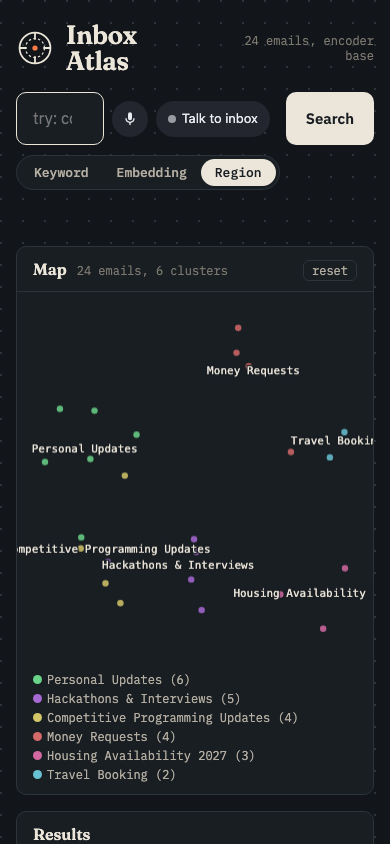
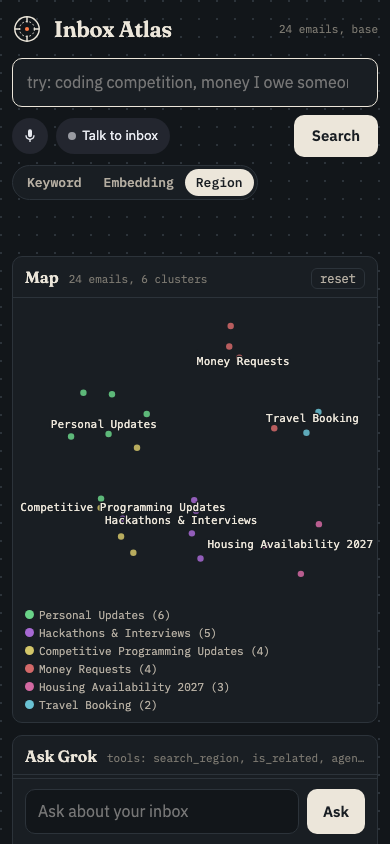
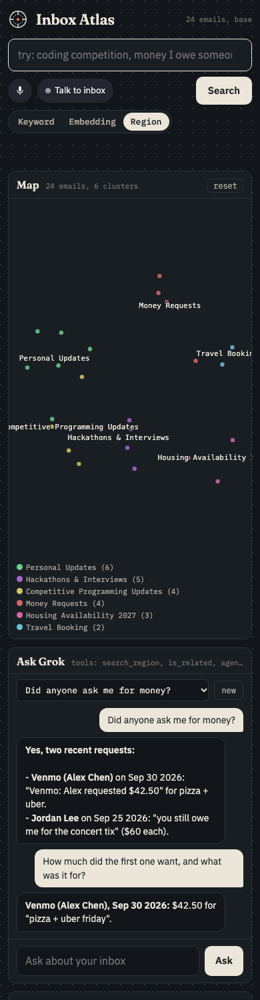
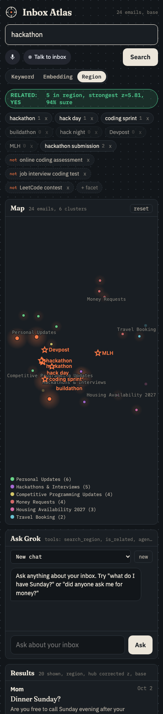

# Inbox Atlas on your phone

Everything runs on your Mac. One command starts it, and the phone reaches it two ways:
iMessage through Photon, or the web app over Tailscale.

```sh
uv run atlas up          # API, iMessage sidecar, Postgres (if configured), Gmail polling
uv run atlas status      # what is running, emails indexed, Photon, last brief
uv run atlas phone       # the phone URL and the tailscale command
uv run atlas logs -f     # api.log, imessage.log, db.log, daemon.log under data/logs/
uv run atlas down
```

## Keep it running (LaunchAgent)

```sh
uv run atlas install-service
launchctl bootstrap gui/$(id -u) ~/Library/LaunchAgents/com.inboxatlas.daemon.plist
```

The agent runs `atlas up --foreground` at login and launchd restarts it if it exits
(`KeepAlive`). Inside it, each service restarts on crash with backoff (1s, 2s, 4s up to 60s).
To remove: `launchctl bootout gui/$(id -u)/com.inboxatlas.daemon && uv run atlas uninstall-service`.
The Mac has to be awake: System Settings > Battery > Options > "Prevent automatic sleeping
when the display is off" on power, or `caffeinate -s` while demoing.

## 1. iMessage (Photon)

Set in `.env`: `SPECTRUM_PROJECT_ID`, `SPECTRUM_PROJECT_SECRET`, `OWNER_PHONE` (see
[IMESSAGE.md](IMESSAGE.md)). `atlas up` then starts the Node sidecar on port 8766, and
`atlas status` shows `Photon connected`.

**One time step:** text the Photon line once from your phone (anything, like `help`). Shared
Spectrum lines cannot start a conversation, so the morning brief and watch alerts only reach you
after you have texted first. `atlas status` reminds you until it has seen your thread.

Each sender gets one server side chat session (`imessage:+1607...`), so the conversation keeps
context and also shows up in the web app's chat list.

Other platforms: `SPECTRUM_PROVIDERS=imessage,whatsapp,telegram` runs the same agent on
WhatsApp Business (`WHATSAPP_ACCESS_TOKEN`, `WHATSAPP_PHONE_NUMBER_ID`, or enable it in the Photon
dashboard and leave those empty) and Telegram (`TELEGRAM_BOT_TOKEN`). Add your handle on those
platforms to `OWNER_HANDLES` (or `ALLOW_ANY=1`).

No credentials yet? `ATLAS_SIDECAR=mock uv run atlas up` runs the sidecar in mock mode and
`curl -X POST localhost:8766/mock/inbound -d '{"text":"today"}'` plays a text.

## 2. Web app over Tailscale

The Mac is on the tailnet as `mccrispy` (100.64.0.7). Install Tailscale on the phone and log in
to the same tailnet.

**HTTPS (recommended).** The API stays bound to localhost and Tailscale proxies to it:

```sh
tailscale serve --bg 8765
```

Open `https://mccrispy.<your-tailnet>.ts.net/` on the phone (`atlas phone` prints the exact
name). Undo with `tailscale serve --https=443 off`. `atlas` never changes Tailscale settings by
itself; `atlas phone --serve` runs that one command if you ask it to.

**Plain HTTP by IP.** Set a token, which also makes the API listen on all interfaces:

```sh
echo "ATLAS_TOKEN=$(openssl rand -hex 12)" >> .env
uv run atlas down && uv run atlas up
```

then open `http://100.64.0.7:8765/`. The page asks for the token once and keeps it in
localStorage (or open `/?token=...` once). With `ATLAS_TOKEN` set every `/api` route and the
voice websocket need it (`Authorization: Bearer`, `X-Atlas-Token` or `?token=`); without it the
server only listens on 127.0.0.1. Using the token with `tailscale serve` too is a good idea.

**Home screen.** In Safari: Share > Add to Home Screen. The app has a manifest and icon and
opens full screen.

The layout at phone width (390px), checked with `scripts/phone_shot.py`:

| before | after | chat session | search |
|---|---|---|---|
|  |  |  |  |

## Ports and env

| Var | Default | What |
|---|---|---|
| `PORT` | 8765 | API server |
| `SIDECAR_PORT` | 8766 | iMessage sidecar (always 127.0.0.1) |
| `ATLAS_TOKEN` | empty | shared token; when set the API binds 0.0.0.0 |
| `ATLAS_HOST` | auto | override the bind address |
| `ATLAS_SIDECAR` | auto | `mock` forces the mock sidecar, `off` disables it |
| `ATLAS_DB` | empty | `pg` runs `docker compose up -d` (tiger branch's docker-compose.yml) |
| `SPECTRUM_PROVIDERS` | imessage | comma list: imessage, whatsapp, telegram, slack |
